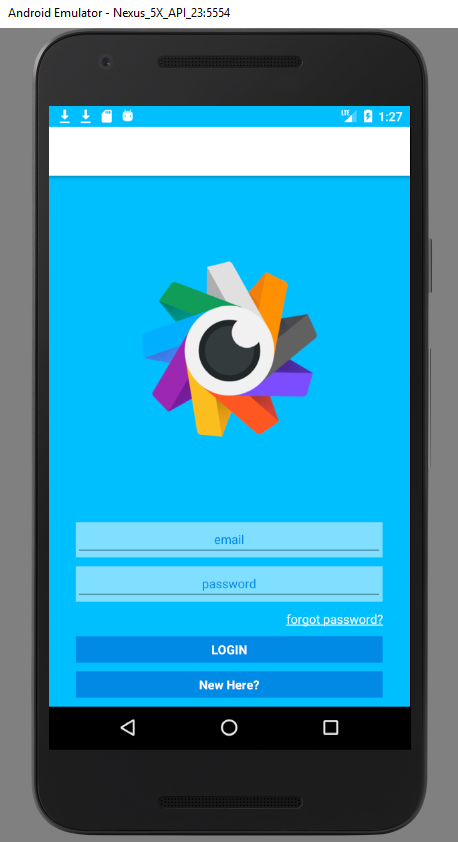
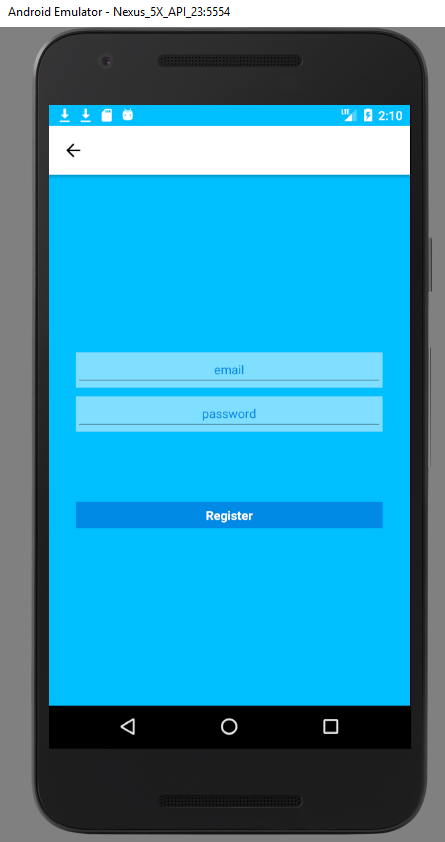
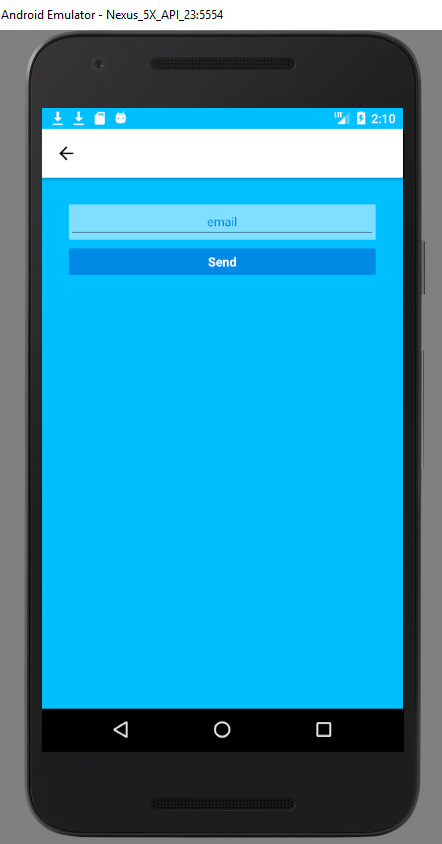
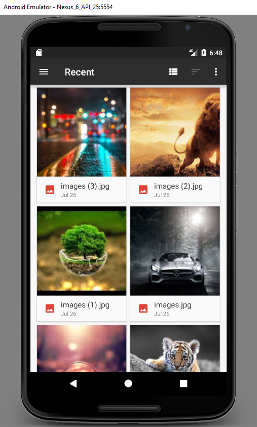
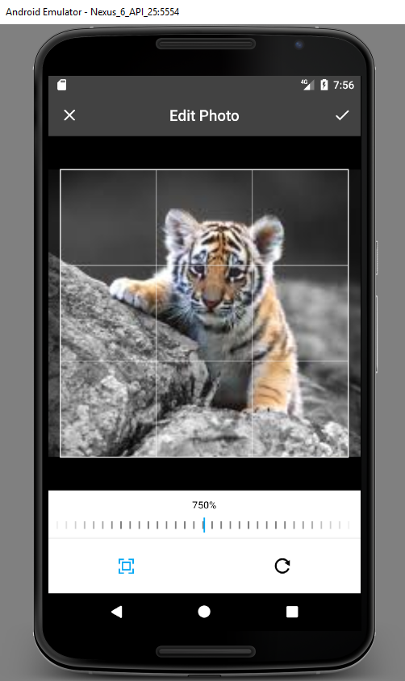
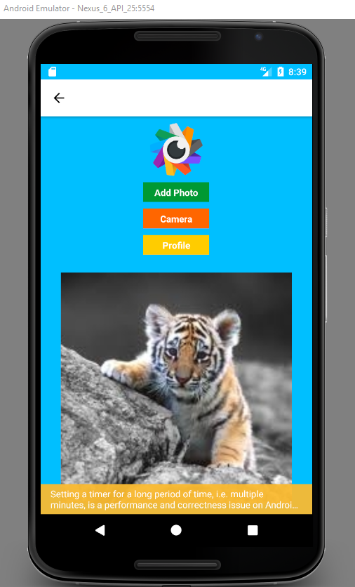

# SimpleInstagram

First of all, we wrote the command to CMD to create the React-Native app:

      react-native init project_name

To run React-Native project:

      react-native start  
      react-native run-android

Below, you can see application's home page and registration pages' screenshots:

    

Mobile applications are very rarely one-page applications. Developers usually use multiple screens more than single screen. And they use components to make transitions between these pages. In React-Native, there are several components to make these transitions. In this project, we prefer the Router structure. In order to use this structure we run this command and implement it into project:

      npm install react-native-router-flux --save 

The router that navigates through the pages takes advantage of the actions. Whenever we want to change a page, we call Actions with the keys defined by using the scene for each page. 

About Database:
In the project, we benedited from Firebase database to save images that user uploaded. To use Firebase:

      npm install firebase --save
      
In addition, we used Firebase's authentication functions such as createUserWithEmailAndPassword(), signInWithEmailAndPassword() and sendPasswordResetEmail(). You can visit Authenticate with Firebase tutorial for more information about usage of these functions <a href="https://firebase.google.com/docs/auth/web/password-auth">here.</a>

For photo selection and resizing of the photo from gallery:

      npm install react-native-image-crop-picker --save
      react-native link react-native-image-crop-picker
      npm install react-native-fetch-blob --save
      react-native link react-native-fetch-blob

Screenshots of these operations:

    

To access the camera from the emulator:
  
      npm install react-native-camera --save
      react-native link react-native-camera
      
Please add uses-permissions into AndroidManifest.xml to use camera. It is necessary.

      <uses-permission android:name="android.permission.INTERNET" />
      <uses-permission android:name="android.permission.SYSTEM_ALERT_WINDOW" />
      <uses-permission android:name="android.permission.RECORD_AUDIO" />
      <uses-permission android:name="android.permission.RECORD_VIDEO" />
      <uses-permission android:name="android.permission.READ_EXTERNAL_STORAGE" />
      <uses-permission android:name="android.permission.WRITE_EXTERNAL_STORAGE" />
      <uses-feature android:name="android.hardware.camera" />
      <uses-feature android:name="android.hardware.camera.autofocus" />
      
Note that: in this project the part of camera has not written by me so you can visit the page that we get camera codes, <a href="https://github.com/react-native-community/react-native-camera">here.</a>
      
      
